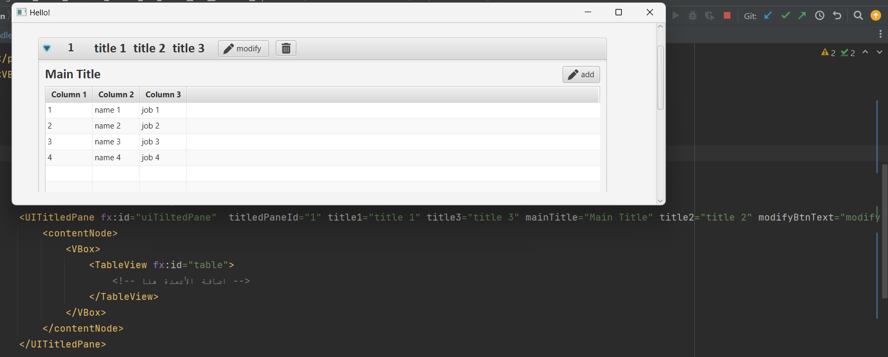

#  com.toofan.soft.UIFX  library v1.0
## About
This library provides 4 UI components designed for JavaFX applications. It is built upon some components from the [MaterialFX](https://github.com/palexdev/MaterialFX) library available on GitHub.

## Components
- UITitlePane
- UIImageView
- UITreeItem
- UIStepper

## Usage
To use `com.toofan.soft.UIFX` library in your JavaFX project, you can include it as a dependency in your build file. For example, in Gradle:

```gradle
dependencies {
    implementation 'com.toofan.soft:UIFX:1.0'
}
```

this simple example  for UITitlePane




### By [Toofan-Soft](https://github.com/Toofan-Soft)


 Eng. [Rafiq7M](https://github.com/Rafiq7M) and  Eng. [EyadAljlal](https://github.com/EyadAljlal)